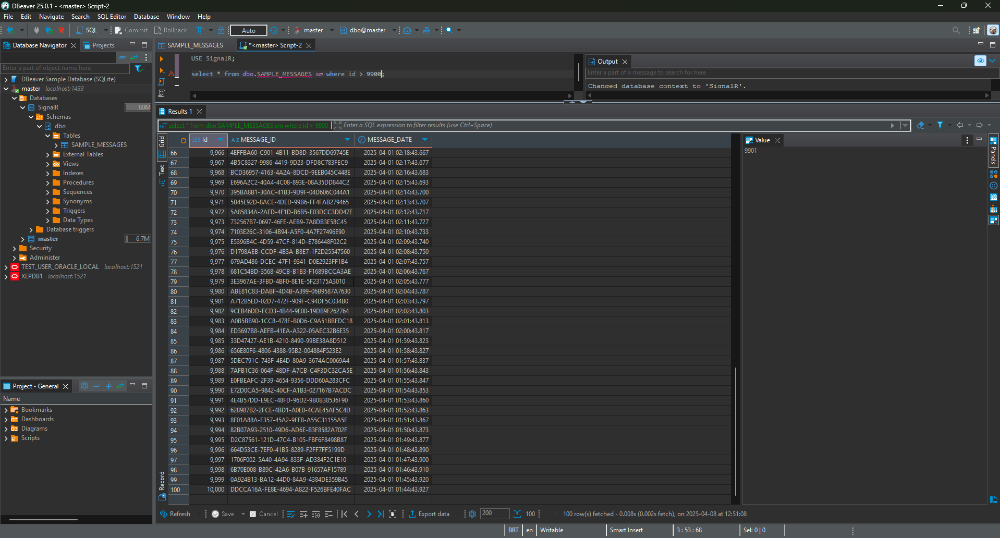
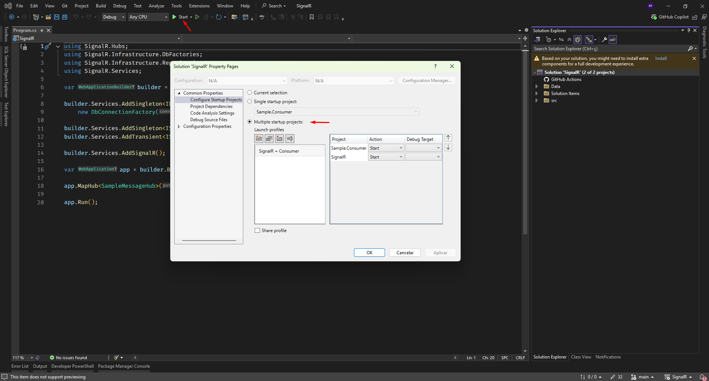
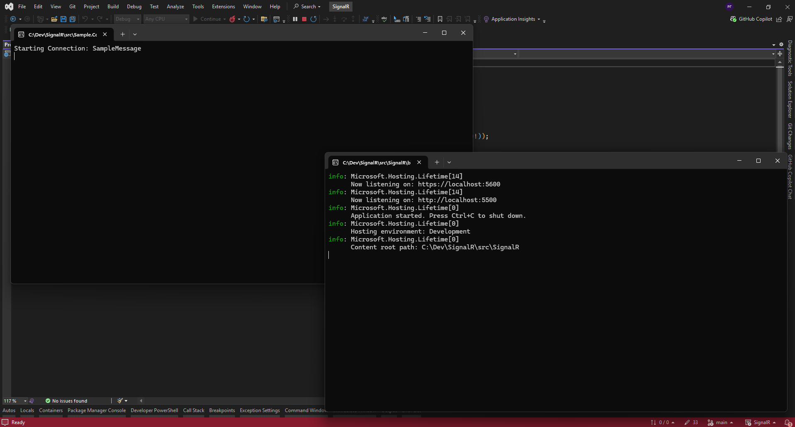
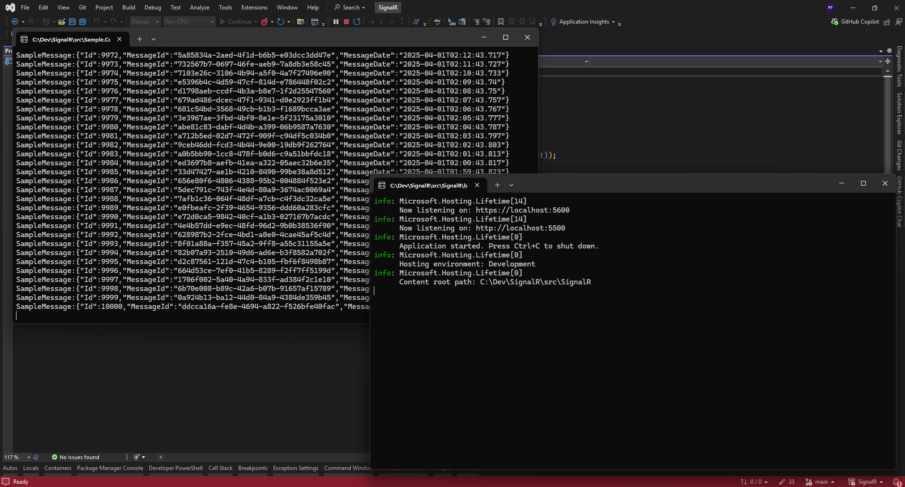

# SignalR POC Project

This project was created to demonstrate the use of SignalR in a .NET Core application. It includes some scripts that will create a database in Sql Server and populate it with 10000 sample records.



It also includes a sample console application that will connect to the SignalR hub and receive the messages sent by the server and print them in the console.

To run the project, after cloning it, you need to run the following command:

```bash
docker-compose up -d
```

This docker-compose will automatically create a Sql Server and poplate the database.

Run the project via Visual Studio with the pre-defined launch settings. Both the server and the client application will be initalized:



If everything works fine it will start:



And will consume all messages:



<hr>

### Have you ever considered using SignalR instead of a REST Api? Well, this POC was to register a project we did with that purpose. And it worked fine :-)
